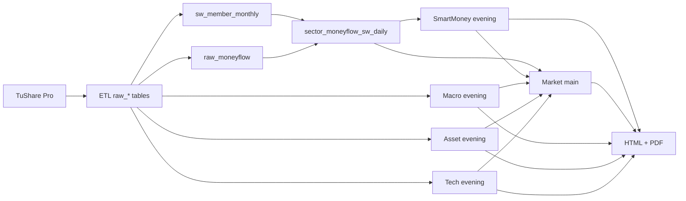

# Architecture

iFA V2.1 is a deterministic report-generation system: every output is a `ReportRun` row plus its child `report_sections`, `report_judgments`, and `model_outputs`. There is no chat surface and no streaming UI. This document describes the composition of the system and the data flow through it.

---

## 1+3+SmartMoney composition

```
                       ┌─────────────────────┐
                       │   Market (main)     │  总指挥型 — 1 family
                       │   morning/noon/eve  │
                       └──────────▲──────────┘
                                  │ consumes 三辅 verdicts at evening
        ┌─────────────────────────┼─────────────────────────┐
        │                         │                         │
   ┌────┴─────┐             ┌─────┴────┐             ┌──────┴───┐
   │  Macro   │             │  Asset   │             │   Tech   │   3 auxiliaries
   │ morning/ │             │ morning/ │             │ morning/ │   morning + evening only
   │ evening  │             │ evening  │             │ evening  │
   └──────────┘             └──────────┘             └──────────┘

                       ┌─────────────────────┐
                       │  SmartMoney (sep)   │   own ETL/compute/backtest/train pipeline
                       │  evening only       │   surfaced into Market evening as one of 三辅
                       └─────────────────────┘
```

Why this split:

- **Market** is the customer-visible "what happened in A 股 today and what to watch tomorrow". It is the only family with three slots (morning brief / noon update / evening recap).
- **Macro / Asset / Tech** are *thematic* aux reports that exist independently for users who want depth in those slices. The Market evening report cites their conclusions.
- **SmartMoney** has a fundamentally different lifecycle (multi-year raw backfill, factor compute jobs, periodic ML training, parameter freezing) and runs as its own subsystem. It produces an evening report and a structured signal feed; both feed the Market evening 三辅 box.

---

## Data flow per family

### Market

| Stage | Inputs | Outputs |
|---|---|---|
| TuShare | `daily`, `daily_basic`, `index_daily`, `top_list`, `limit_list_d`, `moneyflow_hsgt`, `sw_daily` (L1) | rows in `smartmoney.raw_*` |
| Sector axis | `smartmoney.sector_moneyflow_sw_daily` (净流入), `sw_member_monthly` (板块成员), aggregated `pct_change` from member stocks | dynamic top-N SW L2 主线 list |
| Sections | S1 commentary · S2 index_panel · S3 category_strength (SW L1 strength heatmap) · S4 sentiment_grid · S5 dragon_tiger · S6 three_aux_summary · S7/S8 morning/noon review_table · S9 focus_deep · S10 focus_brief · S11 attribution · S12 hypotheses_list · S13 watchlist · S14 disclaimer | `report_sections` rows + final HTML |

**Main-line dynamic query** (paraphrased):

```sql
SELECT l2_code, l2_name, net_amount,
       (SELECT AVG(pct_chg) FROM raw_daily d
        JOIN sw_member_monthly m USING (ts_code)
        WHERE m.l2_code = s.l2_code
          AND m.snapshot_month = date_trunc('month', :rd)::date
          AND d.trade_date = :rd) AS avg_pct_chg
FROM smartmoney.sector_moneyflow_sw_daily s
WHERE trade_date = :rd
ORDER BY net_amount DESC
LIMIT :n;
```

### Macro

| Stage | Inputs | Outputs |
|---|---|---|
| TuShare structured | `cn_gdp`, `cn_cpi`, `cn_ppi`, `shibor`, `moneyflow_hsgt`, `margin` | indicator rows |
| Pre-jobs | `ifa job text-capture` (LLM-extracted indicators from news), `ifa job policy-memory` (curated policy events) | text-signal rows |
| Sections | S1 commentary · S2 review_table · S3 news_list · S4 data_panel · S5 liquidity_grid · S6 cross_asset_grid · S7 attribution · S8 watchlist · S9 hypotheses_list · S10 indicator_capture_table · S11 disclaimer | report HTML |

No SW dependency — Macro has no sector axis.

### Asset

| Stage | Inputs | Outputs |
|---|---|---|
| TuShare | commodity futures (原油 / 黄金 / 铜 / 螺纹钢 / 焦炭 / 玉米 / 豆粕 / 棉花 ...), `sw_daily` (L1), `raw_daily` for member stocks | raw rows |
| Sector axis | 18 SW L2 sectors flagged as commodity-relevant (上游资源 / 中游材料): 有色金属, 钢铁, 煤炭, 石油石化, 基础化工, 农业, etc. | per-chain commodity → sector strength table |
| Sections | S1 commentary · S2 commodity_dashboard · S3 category_strength · S4 review_table · S5 transmission_review · S6 chain_review · S7 news_list · S8 watchlist · S9 hypotheses_list · S10 disclaimer | report HTML |

### Tech

| Stage | Inputs | Outputs |
|---|---|---|
| TuShare | `raw_daily`, `raw_moneyflow`, `sw_daily`, `kpl_list` for 涨停 leaders | raw rows |
| Sector axis | the 5-layer SW L2 mapping (see `docs/sw-migration.md` and `docs/family-reference.md`) | per-layer 强度/资金流/龙头 table |
| Sections | S1 commentary · S2 layer_map · S3 category_strength · S4 review_table · S5 leader_table · S6 candidate_pool · S7 focus_deep · S8 focus_brief · S9 news_list · S10 watchlist · S11 hypotheses_list · S12 disclaimer | report HTML |

### SmartMoney

| Stage | Inputs | Outputs |
|---|---|---|
| ETL (`etl/runner.py`, `etl/raw_fetchers.py`) | TuShare 20+ endpoints (`daily`, `moneyflow`, `top_inst`, `kpl_list`, `top_list`, `limit_list_d`, `block_trade`, `moneyflow_hsgt`, `sw_daily`, `index_daily`, ...) | `smartmoney.raw_*` |
| SW member ETL (`etl/sw_member_fetcher.py`) | TuShare `index_member_all` for 申万 L1 / L2 / L3 | `raw_sw_member` (5,847 rows full history) → derived `sw_member_monthly` (327k rows, 65 monthly snapshots) |
| Sector flow aggregation (`etl/sector_flow_sw_l2.py`) | `raw_moneyflow` joined to `sw_member_monthly` | `sector_moneyflow_sw_daily` (the canonical SW L2 资金流 table) |
| Factor compute (`factors/{flow,liquidity,role,cycle,leader,candidate}.py`) | aggregated SW L2 data | `factor_daily`, `market_state_daily`, `sector_state_daily`, `stock_signals_daily` |
| ML (`ml/{features,dataset,logistic,random_forest,xgboost_model,news_catalyst,persistence}.py`) | factor matrix, news catalysts | pickled models + `manifest.json` under `~/claude/ifaenv/models/smartmoney/`, predictions to `predictions_daily` |
| Backtest (`backtest/{metrics,engine,runner}.py`) | factor + label history | `backtest_runs` + `backtest_metrics` |
| Param store (`params/{default.yaml,store.py}`) | best-backtest selection | `param_versions` table |
| Report (`evening.py`) | all of the above + LLM persona | 14 `report_sections` + HTML |

---

## Shared infrastructure (`ifa.core.*`)

| Module | Responsibility |
|---|---|
| `ifa.core.db` | Single `get_engine()` factory. Reads connection URL from settings, returns a SQLAlchemy 2.0 engine. All queries use `text()` — no ORM. |
| `ifa.core.tushare` | Token-aware TuShare wrapper with retry (`tenacity`) and consistent error logging. |
| `ifa.core.llm` | OpenAI-compatible client. Primary model `gpt-5.4`, fallback `gpt-5.5` on transient error. Returns structured JSON via response_format where supported. |
| `ifa.core.render.html` | Jinja2 environment + section dispatcher (`templates/report.html`). All CSS is inline; HTML is fully self-contained (no CDN). |
| `ifa.core.render.pdf` | Headless Chrome wrapper. Injects print-CSS, force-opens `<details>` blocks, runs `chrome --headless --print-to-pdf`. |
| `ifa.core.render.sparkline` | Inline-SVG sparkline generator for trend mini-charts. |
| `ifa.core.report` | `ReportRun` lifecycle helpers. |

---

## ReportRun lifecycle

```
1. CLI parses --slot/--report-date/--mode and builds a ReportRunCtx
2. core.report.start_run()   → INSERT report_runs (status='running')
3. data.py loaders run       → DataFrames in memory
4. for each section:
     - prompt builder         → build LLM input from data + persona
     - LLM call               → JSON content
     - core.report.insert_section(name, content_json, evidence_json, prompt_json, llm_io_json)
5. render.html.render_report(run_id)  → standalone HTML to disk
6. core.report.finalize_run(run_id, output_html_path, status='ok')
7. (optional) html_to_pdf(html_path)   → matching PDF
```

If any step raises, the run is finalised with `status='error'` so review queries can exclude it.

---

## LLM usage pattern

All LLM calls go through `ifa.core.llm`:

- Primary: `gpt-5.4` via OpenAI-compatible relay
- Fallback: `gpt-5.5` on retryable error (rate limit, timeout, 5xx)
- Response format: JSON when available; plaintext for free-form commentary
- Persona: each family defines a `SYSTEM_PERSONA` string in `prompts.py`
- Cost discipline: SmartMoney aggregates 7 prompt bundles into 7 LLM calls per evening, not one per sector
- Output framing: prompts forbid 买/卖 directives; outputs must use 观察 / 假设 / 验证点 vocabulary

Every LLM call's `(input, output, model, latency_ms)` is captured into `model_outputs` for audit.

---

## Run modes (architectural view)

The full semantic detail lives in [`run-modes.md`](run-modes.md). Architecturally:

- **Mode is selected at engine-construction time.** `IFA_RUN_MODE` (or `--mode`) routes `get_engine()` to either `ifavr_test` or `ifavr`. There is no in-process switching.
- **`run_mode` is also a column on `report_runs`.** Even within `ifavr` (production DB) we distinguish scheduled vs. operator-initiated runs.
- **Output paths mirror the mode** so test artifacts can be cleaned up independently.
- **No mock layer.** Test mode hits real LLM + TuShare; only the DB and output dir are isolated.

---

## Mermaid: family-to-table dependency


