# V2.2 三家族 Schema 综合 Review

> **目的**：在三家族开始 Alembic migration 前，统一 review schema 设计的一致性、外键完整性、命名规范、索引覆盖。
> **范围**：`research.*`（11 张表）/ `ta.*`（13 张表）/ `stock.*`（8 张表 PG + 4 张 DuckDB）= 共 32+ 张新表
> **既有依赖**：`smartmoney.*`（约 20 张已有表）、`ningbo.*`（约 10 张已有表）、`public.*`（report_runs 等核心表）

---

## 1. Schema 全图（Mermaid）

```mermaid
erDiagram
    %% ─── 既有 schema（不修改） ─────────────────────────────
    SMARTMONEY_RAW_DAILY ||--o{ TA_FACTOR_PRO : "ts_code,trade_date"
    SMARTMONEY_RAW_MONEYFLOW ||--o{ TA_CANDIDATES : "ts_code,trade_date"
    SMARTMONEY_SW_MEMBER_MONTHLY ||--o{ STOCK_ANALYSIS : "ts_code 板块归属"
    NINGBO_CANDIDATES_DAILY ||--o{ TA_CANDIDATES : "P1 setup 来源"

    %% ─── Research 家族 ────────────────────────────────────
    RESEARCH_COMPANY_IDENTITY ||--o{ RESEARCH_REPORT_RUNS : "1:N"
    RESEARCH_REPORT_RUNS ||--o{ RESEARCH_REPORT_SECTIONS : "1:N"
    RESEARCH_REPORT_RUNS ||--o{ RESEARCH_REPORT_JUDGMENTS : "1:N"
    RESEARCH_API_CACHE }o--|| RESEARCH_COMPANY_IDENTITY : "ts_code"
    RESEARCH_COMPUTED_CACHE }o--|| RESEARCH_COMPANY_IDENTITY : "ts_code"
    RESEARCH_COMPANY_EVENT_MEMORY }o--|| RESEARCH_COMPANY_IDENTITY : "ts_code"
    RESEARCH_USERS ||--o{ RESEARCH_USAGE_LOG : "1:N"

    %% ─── TA 家族 ──────────────────────────────────────────
    TA_FACTOR_PRO ||--o{ TA_REGIME : "trade_date"
    TA_REGIME ||--o{ TA_CANDIDATES : "trade_date,regime"
    TA_CANDIDATES ||--o{ TA_CANDIDATE_TRACKING : "1:N"
    TA_SETUP_METRICS ||--o{ TA_CANDIDATES : "setup_name"
    TA_CYQ_CHIPS ||--o{ TA_CANDIDATES : "ts_code,trade_date"
    TA_HOT_RANK ||--o{ TA_CANDIDATES : "ts_code,trade_date"
    TA_CATALYST_EVENT_MEMORY }o--o{ TA_CANDIDATES : "ts_code"

    %% ─── Stock Intel 家族 ────────────────────────────────
    STOCK_ANALYSIS_RECORD ||--o{ STOCK_REPORT_SECTIONS : "1:N"
    STOCK_ANALYSIS_RECORD ||--o{ STOCK_TRACKING_LOG : "1:N"
    STOCK_ANALYSIS_RECORD ||--o| STOCK_ANALYSIS_RECORD : "base_record_id (update)"
    STOCK_ANALYSIS_LOCK |o--|| STOCK_ANALYSIS_RECORD : "holder_record_id"
    STOCK_USER_WATCHLIST }o--|| STOCK_ANALYSIS_RECORD : "last_record_id"
    STOCK_SUPPORT_RESISTANCE }o--|| STOCK_ANALYSIS_RECORD : "ts_code,trade_date"

    %% ─── 跨家族协作（虚线 = 只读消费） ──────────────────────
    STOCK_ANALYSIS_RECORD }o..|| RESEARCH_REPORT_RUNS : "读取最近 deep"
    STOCK_ANALYSIS_RECORD }o..|| TA_CANDIDATES : "查 historical appearance"
    STOCK_ANALYSIS_RECORD }o..|| TA_REGIME : "当日 regime"
    STOCK_ANALYSIS_RECORD }o..|| TA_CATALYST_EVENT_MEMORY : "催化事件"
```



---

## 2. 命名规范统一

### 2.1 字段命名

所有家族强制：

| 概念 | 字段名 | 类型 |
|------|-------|------|
| 股票代码 | `ts_code` | VARCHAR(12) |
| 交易日期 | `trade_date` | DATE |
| 公告日期 | `ann_date` | DATE |
| 报告期末日 | `end_date` | DATE |
| 公告时间戳 | `publish_time` | TIMESTAMPTZ |
| 触发时间 | `triggered_at` | TIMESTAMPTZ |
| 完成时间 | `completed_at` | TIMESTAMPTZ |
| 创建时间 | `created_at` | TIMESTAMPTZ DEFAULT now() |
| 更新时间 | `updated_at` | TIMESTAMPTZ |
| 数据截止 | `data_cutoff_at` | TIMESTAMPTZ |
| 用户 ID | `user_id` | UUID |
| 报告 ID | `record_id` / `run_id` | UUID |
| SW L1 / L2 代码 | `sw_l1_code` / `sw_l2_code` | VARCHAR(12) |
| SW L1 / L2 名 | `sw_l1_name` / `sw_l2_name` | VARCHAR(32) |

### 2.2 单位后缀（强制）

参考 [`data-accuracy-guidelines.md`](data-accuracy-guidelines.md) 第一条：

| 概念 | 后缀 | 示例 |
|------|------|-----|
| 金额（元） | `_yuan` | `total_revenue_yuan`, `change_amount_yuan` |
| 股数（股） | `_share` | `hold_amount_share`, `change_vol_share` |
| 比例（0-100） | `_pct` | `hold_ratio_pct`, `pct_change_pct` |
| 价格 | `_price` | `close_price`, `avg_price` |
| 倍数 | `_x` 或无后缀 | `pe_ttm`, `pb` |

### 2.3 状态枚举（TEXT CHECK 约定）

复用 `public.report_runs` 的约定模式：

| 字段 | 取值 |
|------|-----|
| `status` (运行) | `running` / `succeeded` / `partial` / `failed` / `cached` / `superseded` |
| `run_mode` | `test` / `manual` / `production` |
| `severity` | `high` / `medium` / `low` / `info` |
| `confidence` | `high` / `medium` / `low` |
| `validation_status` | `confirmed` / `partial` / `invalidated` / `pending` / `expired` / `timeout` |

---

## 3. 跨 Schema 外键策略

**原则**：跨 schema 不建硬外键（PostgreSQL FK），用应用层强制 + index 保证 join 性能。

理由：
- 三家族独立部署、独立失效、独立测试
- 硬外键导致 cascade delete 风险（删一行打翻所有）
- 跨 DuckDB / PG 的引用本身就只能软引用

实现：
- `research.report_runs(run_id)` 在 `stock.analysis_record(reused_research_run_id)` 中以 UUID 存储，无 REFERENCES
- 应用层在读取时显式 LEFT JOIN，缺失数据降级处理
- 索引必须覆盖跨 schema 查询路径

---

## 4. 索引完整性 Checklist

### 4.1 高频查询路径

| 查询 | 涉及表 | 必备索引 |
|------|-------|---------|
| 给定股票最近 N 天 5min 数据 | `stock.intraday_5min` (DuckDB) | (ts_code, trade_time) |
| 给定股票最近 deep 报告 | `stock.analysis_record` | (ts_code, analysis_type, triggered_at DESC) |
| 给定 record_id 的 sections | `stock.report_sections` | (record_id) |
| 给定锁是否存在 | `stock.analysis_lock` | PK lock_key |
| 给定股票被哪些 setup 选中过 | `ta.candidates_daily` | (ts_code, trade_date) + (setup_name, trade_date) |
| 给定日期所有 candidates | `ta.candidates_daily` | (trade_date, in_top_watchlist DESC) |
| 给定股票事件记忆 | `ta.catalyst_event_memory` / `research.company_event_memory` | (ts_code, capture_date DESC) + GIN(target_ts_codes) |
| 给定股票财务多期 | `research.api_cache` | (ts_code, api_name, params_hash) PK |

### 4.2 GIN 索引（数组 / JSONB）

- `ta.catalyst_event_memory.target_ts_codes` GIN
- `ta.catalyst_event_memory.target_sectors` GIN
- `stock.support_resistance.sources` GIN
- 所有 `*_json` 字段如需 path 查询加 GIN

---

## 5. JSONB 字段 Schema 文档化

每个 JSONB 字段在 migration 注释中给出 schema：

### `stock.analysis_record.forecast_json`

```json
{
  "horizons": ["1M", "3M", "6M"],
  "quantiles": {
    "1M": {"p10": -0.082, "p25": -0.025, "p50": 0.031, "p75": 0.098, "p90": 0.182},
    "3M": {...},
    "6M": {...}
  },
  "scenarios": [
    {"label": "bullish", "prob": 0.40, "trigger": "...", "range_1m": [72, 82]},
    ...
  ],
  "analogs": [
    {"ts_code": "003456.SZ", "end_date": "2024-08-15", "similarity": 0.91,
     "return_1m": 0.123, "return_3m": 0.085},
    ...
  ],
  "confidence": "medium",
  "model_versions": {"l3_kronos": "v1", "l2_lgbm": "quantile_v1"}
}
```

### `ta.candidates_daily.evidence_json`

```json
{
  "trigger_summary": "突破 60 日新高 67.20，量比 2.3x",
  "facts": [
    {"key": "close_qfq", "value_yuan": 68.50, "display": "68.50"},
    {"key": "vol_ratio", "value": 2.3, "display": "2.3x"},
    ...
  ],
  "sector_context": {...},
  "capital_flow": {...}
}
```

### `research.report_sections.content_json`

随 section_key 不同结构不同；每个 section 在 prompt 文件中定义自己的 JSON schema。

---

## 6. 时间戳与时区

所有 schema 强制：

```sql
-- ✅ 正确
created_at TIMESTAMPTZ DEFAULT now()

-- ❌ 错误
created_at TIMESTAMP
created_at TIMESTAMP WITH TIME ZONE  -- 写法对但不简洁
created_at DATETIME -- 不存在的类型
```

DATE 字段（如 `trade_date`）用 BJT 业务日期，DB 层直接存 DATE 即可（不带时区）。

---

## 7. NUMERIC 精度统一

| 用途 | 类型 |
|------|-----|
| 金额（元） | `NUMERIC(20, 2)` |
| 价格（元/股） | `NUMERIC(12, 4)` |
| 股数 | `NUMERIC(20, 0)` 或 `BIGINT` |
| 比例（0-100） | `NUMERIC(8, 4)` |
| 倍数（PE/PB） | `NUMERIC(12, 4)` |
| 嵌入向量元素（如必要） | `NUMERIC(10, 6)` 或在 DuckDB 用 `FLOAT[256]` |

**禁止**用 FLOAT / REAL / DOUBLE PRECISION 存金融数字。

---

## 8. Migration 执行顺序

V2.2 GA 上线前的 Alembic 链路：

```
既有 head: a9f3c2e17d84
   ↓
V2.2 base merge (空 migration，标记 V2.2 起点)
   ↓
research_schema_v0      ← Research M1.2 产出
   ↓
ta_schema_v0            ← TA TA-M2 产出
   ↓
stock_schema_v0         ← Stock Intel SI-M1.2 产出
   ↓
v2.2.0 GA tag
```

每个 migration 独立 reversible（带 downgrade）；migration 内部不跑 ETL，仅 DDL。

DuckDB 不在 Alembic 管理范围；用 `ifa/families/stock/data/duckdb_schema.sql` + Python 启动时 IF NOT EXISTS 创建。

---

## 9. 数据库分布

### 9.1 PostgreSQL `ifavr` / `ifavr_test`

| Schema | 现状 | V2.2 变化 |
|--------|------|----------|
| `public` | 既有 | 新增 V2.2 migration head；其余不变 |
| `smartmoney` | 既有 | 不变（只读消费） |
| `ningbo` | 既有 | 不变（只读消费 + 模型加载） |
| `research` | **新增** | 8 张表 + 1 张事件记忆 |
| `ta` | **新增** | 13 张表 |
| `stock` | **新增** | 8 张元数据表 |

### 9.2 DuckDB（新引擎）

| 数据库 | 路径 | 内容 |
|-------|------|------|
| `stock.duckdb` | `~/claude/ifaenv/duckdb/stock.duckdb` | timeframe_snapshot / analog_cache + Parquet 视图 |
| Parquet 目录 | `~/claude/ifaenv/duckdb/parquet/intraday_5min/year=YYYY/month=MM/` | 全市场 5min 数据 (~3 GB / 2 年) |
| Parquet 目录 | `~/claude/ifaenv/duckdb/parquet/kronos/year=YYYY/` | Kronos 256-d 嵌入 (~2.5 GB / 2 年) |

### 9.3 文件系统

| 路径 | 内容 |
|------|------|
| `~/claude/ifaenv/out/<run_mode>/<YYYYMMDD>/<family>/` | 渲染产出 HTML/PDF |
| `~/claude/ifaenv/models/stock/quantile_v1/` | LightGBM 量化回归 15 模型 |
| `~/claude/ifaenv/embeddings/ningbo/kronos_small_v1/` | （既有）Kronos 嵌入缓存 |

---

## 10. 跨家族数据契约（接口冻结）

这些字段在三家族协作中是**契约**，命名 / 类型 / 语义不可变：

| 来自 | 字段 | 消费方 | 语义 |
|------|------|-------|------|
| `ta.regime_daily.regime` | VARCHAR(32) | Stock Intel §04 | 9 种之一的字符串 |
| `ta.regime_daily.confidence` | NUMERIC | Stock Intel | 0-1 |
| `ta.candidates_daily.setup_name` | VARCHAR(32) | Stock Intel §10/§13 | T1-C2 等 |
| `ta.candidates_daily.in_top_watchlist` | BOOLEAN | Stock Intel | true 即当日 Top |
| `ta.catalyst_event_memory.event_id` | VARCHAR(32) | Research / Stock Intel | hash(url+time+title) |
| `research.report_sections.content_json` | JSONB | Stock Intel | 各 section_key 自定义 |
| `research.company_identity.sw_l1_code` | VARCHAR(12) | TA / Stock Intel | SmartMoney 既有约定 |

变更这些字段需三家族 owner 共同评审。

---

## 11. 检查清单（Migration 写完前必查）

- [ ] 所有金额字段命名带 `_yuan`，类型 NUMERIC(20, 2)
- [ ] 所有股数字段命名带 `_share`
- [ ] 所有比例字段命名带 `_pct`，类型 NUMERIC(8, 4)
- [ ] 所有时间戳类型为 TIMESTAMPTZ
- [ ] 所有跨表查询路径都有索引
- [ ] JSONB 字段在 migration 注释中带 schema 例子
- [ ] CHECK 约束用 TEXT 而非 ENUM（沿用既有约定）
- [ ] UUID PK 用 `gen_random_uuid()`
- [ ] 不建跨 schema FK
- [ ] 状态枚举值与 §2.3 一致
- [ ] downgrade() 与 upgrade() 对称

---

## 12. 维护规则

1. 任何家族改 schema 之前，先更新本文档的 ER 图与契约表
2. 新加表时同步加索引设计章节
3. 新加 JSONB 字段时同步加 schema 注释例子
4. CI 加一条 lint：检查 NUMERIC 字段命名是否带单位后缀
